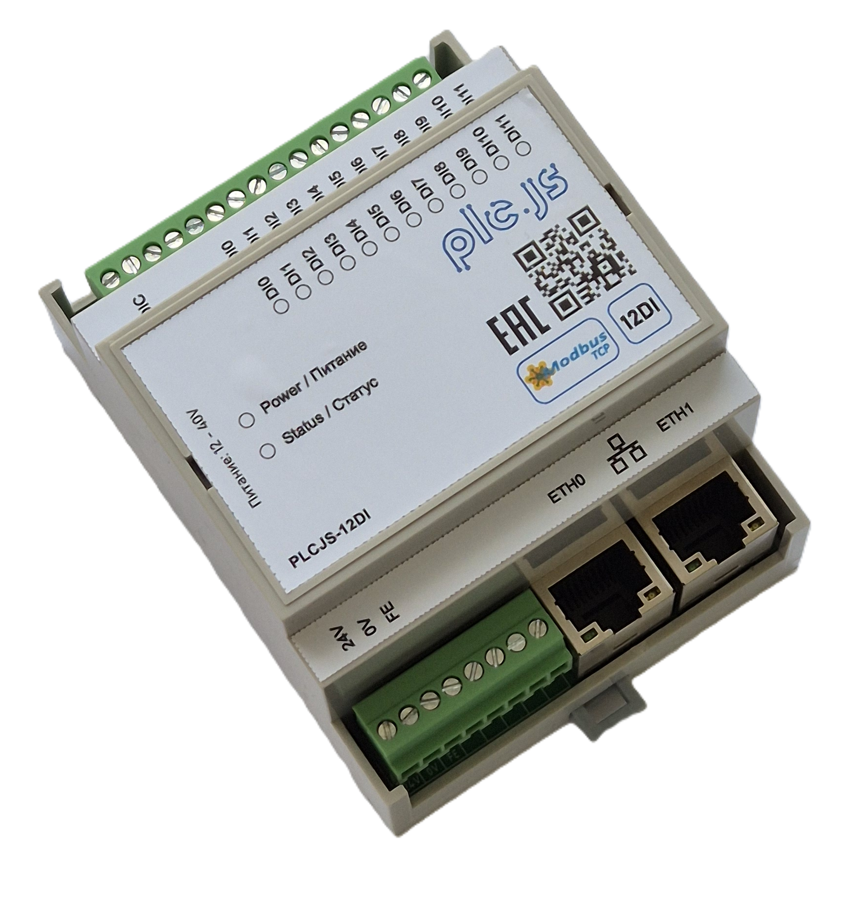

# PLCJS Ethernet 12DI

<p align="center">
  
</p>

<p align="center"><strong>Внешний вид</strong></p>

Ethernet-модуль промышленной автоматики с 12 дискретными входами 24VDC для сбора
состояния датчиков, кнопок, концевых выключателей, контактов реле и других
дискретных сигналов. Модуль подключается к сети Ethernet и предоставляет
данные через Modbus TCP.

Модель: **PLCJS ETH 12DI**

Аппаратная платформа: **STM32F407VGT6**

Количество каналов: **12 дискретных входов**

> Все адреса регистров в документе указаны в нулевой адресации протокола Modbus.
> Если используемая SCADA/HMI показывает адреса как `3xxxx`/`4xxxx` с единицы,
> необходимо учитывать её смещение адресации.

## 1. Назначение и области применения

Модуль предназначен для подключения к контроллеру верхнего уровня по Ethernet
и централизованного чтения дискретных сигналов.

Типовые источники сигналов:

- кнопки управления и кнопки аварийного останова;
- концевые выключатели и датчики положения;
- герконы и сухие контакты;
- контакты промежуточных реле и контакторов;
- дискретные датчики оборудования;
- сигналы состояния автоматов, шкафов и исполнительных механизмов;
- сигналы межблочных блокировок.

Типовые задачи:

- удалённый сбор состояния оборудования;
- передача сигналов в PLC/SCADA/HMI по Modbus TCP;
- диагностика состояния шкафов автоматики;
- регистрация дискретных событий на уровне прикладного контроллера;
- построение распределённых систем ввода/вывода.

Модуль является **модулем дискретного ввода**. Он не выполняет самостоятельно
логическую обработку технологического процесса, не заменяет PLC, реле
безопасности или сертифицированное устройство аварийного отключения.

## 2. Основные возможности

- 12 независимых дискретных входов DI1…DI12;
- чтение входов через Modbus TCP FC02 и FC04;
- цифровой антидребезговый фильтр с настройкой от 10 до 1000 мс;
- общая 12-битная маска состояния входов;
- внутренний датчик температуры MCU для диагностического контроля;
- два внешних Ethernet-порта через встроенный проходной коммутатор KSZ8863;
- автономная передача Ethernet-трафика между внешними портами (при включенном модуле);
- заводская адресация AutoIP/link-local `169.254.x.y`;
- обнаружение и назначение адреса по MAC через PLCJS Discovery Protocol (PDP);
- статический IPv4 и DHCP;
- применение сетевых настроек без перезагрузки после сохранения;
- уникальный локально администрируемый MAC-адрес из UID STM32;
- сохранение настроек во внутренней Flash с CRC32;
- factory reset аппаратной кнопкой или Modbus-командой;
- переход в Ethernet bootloader для OTA-обновления;
- аппаратный watchdog;
- индикация состояния связи и активности Modbus через STAT_LED.

## 3. Быстрый запуск

1. Подключите питание модуля.
2. Подключите дискретные сигналы к входам DI1…DI12 согласно схеме изделия, схема с общим минусом.
3. В заводском состоянии модуль использует link-local-адрес
   `169.254.<mac[4]>.<mac[5]>` с маской `255.255.0.0`.
4. Откройте в ModbusTool вкладку **«Обнаружение»** и выполните поиск через
   нужный сетевой адаптер.
5. Выберите найденный модуль по MAC и назначьте рабочий режим:
   - статический IPv4;
   - DHCP;
   - link-local.
6. Для ответов discovery разрешите входящий UDP-порт `20556` в брандмауэре
   Windows:

```powershell
New-NetFirewallRule -DisplayName "PLCJS PDP discovery" -Direction Inbound `
    -Protocol UDP -LocalPort 20556 -Action Allow
```

7. Подключитесь Modbus TCP-клиентом к назначенному адресу, порту `502`, Unit ID
   `1`.
8. Прочитайте DI через FC02 или FC04. Для проверки подайте на выбранный вход
   номинальный сигнал согласно схеме изделия и убедитесь, что соответствующий
   канал изменился.

## 4. Пользовательские характеристики

### 4.1 Функциональные характеристики

| Параметр | Значение |
|---|---|
| Тип изделия | Ethernet-модуль дискретного ввода |
| Количество дискретных входов | 12 |
| Обозначения каналов | DI1…DI12 |
| Тип входного сигнала | Дискретный, двухуровневый |
| Логика внешнего сигнала | Active-high: подача напряжения на вход означает активное состояние |
| Уровень GPIO MCU | Active-low после аппаратного входного тракта |
| Тип подключения активного сигнала | Подача напряжения 24В на вход относительно общей точки DI_COM |
| Гальваническая развязка входов | 2000V  |
| Номинальное напряжение дискретного входа | 24V |
| Диапазон напряжения входа | 12…30V |
| Порог включения | 20.5V |
| Порог выключения | 5.3V |
| Сопротивление канала | 3.3 kΩ |
| Защита входов от перенапряжения | ESD-супрессор 28V |
| Защита от переполюсовки | Нет |
| Диапазон цифрового фильтра | 10…1000 мс |
| Заводская настройка фильтра | 50 мс |
| Интерфейс управления | Modbus TCP |
| Одновременные Modbus TCP-клиенты | 1 |
| Порт Modbus TCP | 502 |
| Обнаружение устройств | PDP, UDP broadcast, порт 20556 |
| Factory reset | Кнопка FACT_RES и Modbus-команда |
| Индикация состояния | STAT_LED, active-high |
| Watchdog | IWDG |

### 4.2 Характеристики модуля


| Параметр изделия | Значение |
|---|---|
| Наименование | PLCJS Ethernet 12DI / D4MG |
| Исполнение | Модуль промышленной автоматики |
| Тип монтажа | На DIN-рейку |
| Материал корпуса | ABS-пластик |
| Степень защиты корпуса IP | IP20 |
| Габаритные размеры, Ш × В × Г | 72 × 90 × 60 мм |
| Масса | 150 г |
| Диапазон рабочей температуры | -20…+60 °C |
| Диапазон температуры хранения | -40…+85 °C |
| Относительная влажность | 5…95% |
| Высота эксплуатации | до 2000 м |
| Рабочее напряжение питания | 24 В |
| Допустимый диапазон питания | 12…36 В |
| Потребляемая мощность | 1.5 Вт |
| Потребляемый ток | 62.5 мА |
| Тип разъёма питания | Клемма винтовая 3,5 мм |
| Защита питания от переполюсовки | Нет |
| Защита питания от импульсных перенапряжений | ESD-супрессор 40В |
| Ethernet-интерфейс | 10/100 Мбит/с, RMII через KSZ8863 |
| Количество внешних Ethernet-портов | 2 |
| Тип Ethernet-разъёма | RJ45 |
| Поддержка автосогласования Ethernet | Да |
| Максимальная длина Ethernet-сегмента | 100 м для медного сегмента при соблюдении требований кабеля/сети |
| Гальваническая развязка Ethernet | Да |
| Уровень ESD-защиты | 8 kV (Contact) / 15 kV (Air) |
| Уровень EFT/Burst-защиты | 2 kV |
| Уровень Surge-защиты |  |
| Устойчивость к радиочастотному полю |  |
| Эмиссия радиопомех |  |
| Соответствие EMC/EMI нормативам | Да |
| Соответствие RoHS | Да |
| Соответствие CE/EAC/UL | Да |
| MTBF | 50 000 ч |
| Срок службы | 6 лет |
| Гарантийный срок | 2 года |


### 4.3 Сервисные и диагностические характеристики

| Параметр | Значение |
|---|---|
| Уникальный MAC | Локально администрируемый unicast, вычисляется из 96-битного UID STM32 |
| Формат заводского link-local | `169.254.<mac[4]>.<mac[5]>` |
| Маска link-local | `255.255.0.0` |
| Рабочий статический IP по резервным полям | `192.168.1.10/24` |
| Резервный шлюз | `192.168.1.1` |
| Сетевые режимы | `0` static, `1` DHCP, `2` link-local |
| Применение IP/режима | На лету после записи `TRIG_SAVE` |
| Сохранение настроек | Внутренняя Flash, CRC32 |
| Переход в bootloader | Modbus `0xB007`, discovery-команда или OTA-клиент |
| Восстановление KSZ8863 | Modbus `0x8863` в holding register 118 |
| Сброс к заводским настройкам | Modbus `0xDEAD` в holding register 119 или FACT_RES |
| Версия аппаратуры | `0x010101` в образе загрузчика/прошивки |
| Версия прошивки | `0x0106` / 1.6 |
| Module ID | `0x12D1` |
| Product ID | `0x504C1201` |

## 5. Подключение и логика входов

### Схема подключения

<p align="center">
  
</p>

<p align="center"><strong>Схема подключения</strong></p>

| Канал | Программный номер | Состояние `1` | Состояние `0` | GPIO MCU |
|---|---:|---|---|---|
| DI1 | 0 | активен / входной контакт замкнут | неактивен | PD7 |
| DI2 | 1 | активен / входной контакт замкнут | неактивен | PD6 |
| DI3 | 2 | активен / входной контакт замкнут | неактивен | PD5 |
| DI4 | 3 | активен / входной контакт замкнут | неактивен | PD4 |
| DI5 | 4 | активен / входной контакт замкнут | неактивен | PD3 |
| DI6 | 5 | активен / входной контакт замкнут | неактивен | PD2 |
| DI7 | 6 | активен / входной контакт замкнут | неактивен | PD1 |
| DI8 | 7 | активен / входной контакт замкнут | неактивен | PD0 |
| DI9 | 8 | активен / входной контакт замкнут | неактивен | PC12 |
| DI10 | 9 | активен / входной контакт замкнут | неактивен | PC11 |
| DI11 | 10 | активен / входной контакт замкнут | неактивен | PC10 |
| DI12 | 11 | активен / входной контакт замкнут | неактивен | PB3 |


### Антидребезговый фильтр

Фильтр применяется к каждому входу до публикации состояния через Modbus.
Значение задаётся в миллисекундах и ограничивается диапазоном `10…1000` мс.

- меньше `10` мс — ошибка Modbus;
- больше `1000` мс — ошибка Modbus;
- заводское значение — `50` мс;
- фильтр работает в отдельной задаче с периодом дискретизации 1 мс;
- изменение фильтра применяется сразу, а сохранение выполняется через регистр
  `117`.

## 6. Таблица Modbus TCP

### 6.1 Общие параметры протокола

| Параметр | Значение |
|---|---|
| Транспорт | Modbus TCP over Ethernet |
| TCP-порт по умолчанию | 502 |
| Unit ID по умолчанию | 1 |
| Одновременные клиенты | 1 |
| FC02 | Read Discrete Inputs |
| FC03 | Read Holding Registers |
| FC04 | Read Input Registers |
| FC06 | Write Single Holding Register |
| FC16 (0x10) | Write Multiple Holding Registers |
| FC01/FC05/FC15 | Не используются приложением |
| FC02/FC04 состояние входа | Отфильтрованное состояние |

### 6.2 Discrete Inputs — FC02

Адреса `0…11` содержат отфильтрованное состояние входов DI1…DI12.

| Адрес | Канал | Значение `0` | Значение `1` | Доступ |
|---:|---|---|---|---|
| 0 | DI1 | неактивен | активен | R |
| 1 | DI2 | неактивен | активен | R |
| 2 | DI3 | неактивен | активен | R |
| 3 | DI4 | неактивен | активен | R |
| 4 | DI5 | неактивен | активен | R |
| 5 | DI6 | неактивен | активен | R |
| 6 | DI7 | неактивен | активен | R |
| 7 | DI8 | неактивен | активен | R |
| 8 | DI9 | неактивен | активен | R |
| 9 | DI10 | неактивен | активен | R |
| 10 | DI11 | неактивен | активен | R |
| 11 | DI12 | неактивен | активен | R |

### 6.3 Input Registers — FC04

| Адрес | Имя | Формат | Описание | Доступ |
|---:|---|---|---|---|
| 0…11 | `DI1…DI12` | `uint16`, 0/1 | Отфильтрованное состояние соответствующего входа | R |
| 120 | `FW_VERSION_MAJOR` | `uint16` | Старшая часть версии прошивки; для 1.6: `1` | R |
| 121 | `FW_VERSION_MINOR` | `uint16` | Младшая часть версии прошивки; для 1.6: `6` | R |
| 122 | `UPTIME_LO` | `uint16` | Секунды работы, младшее слово | R |
| 123 | `UPTIME_HI` | `uint16` | Секунды работы, старшее слово | R |
| 124 | `DI_MASK` | `uint16` | 12-битная маска отфильтрованных входов, бит 0 = DI1 | R |
| 125 | `MODULE_ID` | `uint16` | Идентификатор модуля: `0x12D1` | R |

Секунды работы вычисляются так:

```text
uptime_seconds = (IR123 << 16) | IR122
```

Маска входов вычисляется так:

```text
DI_MASK bit 0 = DI1
DI_MASK bit 1 = DI2
...
DI_MASK bit 11 = DI12
```

### 6.4 Holding Registers — FC03 / FC06 / FC16

| Адрес | Имя | Формат / диапазон | Заводское значение | Описание | Доступ |
|---:|---|---|---:|---|---|
| 100 | `DI_FILTER_MS` | `10…1000` мс | 50 | Антидребезговый фильтр всех входов | R/W |
| 101 | `LED_MODE` | `0…2` | 2 | Режим STAT_LED | R/W |
| 102 | `SLAVE_ID` | `1…247` | 1 | Информационный Unit ID для TCP-сессий | R/W |
| 103 | `TCP_PORT` | `1…65535` | 502 | TCP-порт приложения | R/W |
| 104 | `IP_OCTET_1` | `0…255` | 192 | Первый октет резервного static IP | R/W |
| 105 | `IP_OCTET_2` | `0…255` | 168 | Второй октет резервного static IP | R/W |
| 106 | `IP_OCTET_3` | `0…255` | 1 | Третий октет резервного static IP | R/W |
| 107 | `IP_OCTET_4` | `0…255` | 10 | Четвёртый октет резервного static IP | R/W |
| 108 | `MASK_OCTET_1` | `0…255` | 255 | Первый октет маски | R/W |
| 109 | `MASK_OCTET_2` | `0…255` | 255 | Второй октет маски | R/W |
| 110 | `MASK_OCTET_3` | `0…255` | 255 | Третий октет маски | R/W |
| 111 | `MASK_OCTET_4` | `0…255` | 0 | Четвёртый октет маски | R/W |
| 112 | `GW_OCTET_1` | `0…255` | 192 | Первый октет шлюза | R/W |
| 113 | `GW_OCTET_2` | `0…255` | 168 | Второй октет шлюза | R/W |
| 114 | `GW_OCTET_3` | `0…255` | 1 | Третий октет шлюза | R/W |
| 115 | `GW_OCTET_4` | `0…255` | 1 | Четвёртый октет шлюза | R/W |
| 116 | `NET_MODE` / `USE_DHCP` | `0…2` | 2 | `0` static, `1` DHCP, `2` link-local | R/W |
| 117 | `TRIG_SAVE` | `0xA5A5` | 0 | Сохранить настройки и применить их | W |
| 118 | `TRIG_REBOOT` | `0xB00B` | 0 | Перезагрузить приложение | W |
| 118 | `TRIG_BOOTLOADER` | `0xB007` | 0 | Перейти в Ethernet bootloader | W |
| 118 | `TRIG_SWITCH_RESET` | `0x8863` | 0 | Аппаратно сбросить KSZ8863 | W |
| 119 | `TRIG_FACTORY_RESET` | `0xDEAD` | 0 | Сбросить настройки, сохранить и перезагрузить | W |
| 130 | `MCU_TEMPERATURE` | signed, 0.1 °C |  | Внутренняя температура MCU, ADC1_IN16 | R |

#### Режимы STAT_LED

| Код | Режим | Описание |
|---:|---|---|
| 0 | `ALW_OFF` | Светодиод выключен |
| 1 | `ALW_ON` | Светодиод постоянно включён |
| 2 | `STATE_MACHINE` | Индикация состояния Ethernet/Modbus |

#### Сетевые режимы

| Код | Режим | Описание |
|---:|---|---|
| 0 | `STATIC` | Используются поля IP/маски/шлюза |
| 1 | `DHCP` | Адрес назначается DHCP-сервером |
| 2 | `LINK_LOCAL` | `169.254.<mac[4]>.<mac[5]>`, маска `/16`, без шлюза |

`TRIG_SAVE` применяется в основном цикле. Изменение IP/режима выполняется через
`tcpip_callback`, поэтому перезагрузка для смены сетевой конфигурации не требуется.
После изменения IP текущая Modbus TCP-сессия может быть разорвана.

Команда `TRIG_SWITCH_RESET` сбрасывает KSZ8863 и временно прерывает Ethernet
на время аппаратного сброса и автосогласования портов. Используйте её только
в случае необходимости. Обычная перезагрузка MCU не должна
сбрасывать KSZ8863.

## 7. Discovery и назначение сети

Модуль поддерживает PLCJS Discovery Protocol (PDP), UDP broadcast, порт
`20556`.

| Команда | Код запроса | Код ответа | Назначение |
|---|---:|---:|---|
| `IDENTIFY` | `0x01` | `0x81` | MAC, Product ID, HW/FW, режим сети, IP, имя |
| `SET_NET` | `0x02` | `0x82` | Назначение static/DHCP/link-local на лету |
| `SET_NAME` | `0x03` | `0x83` | Имя устройства до 15 символов |
| `FLASH_LED` | `0x04` | `0x84` | Мигнуть STAT_LED на заданное время |
| `REBOOT` | `0x05` | `0x85` | Перезагрузка приложения |
| `FACTORY` | `0x06` | `0x86` | Сброс настроек к заводским |

Ответы передаются broadcast, поэтому устройство можно обнаружить по MAC даже
при неизвестном IP в том же L2-сегменте. Для получения ответов на ПК требуется
разрешить входящий UDP `20556`.

## 8. Сеть и проходной Ethernet-коммутатор

KSZ8863 используется как встроенный Ethernet-коммутатор/PHY. Внешние порты
могут работать как проходной сегмент: трафик между ними форвардится аппаратно
и не зависит от прикладной обработки Modbus в MCU.

Политика сброса:

- при холодном старте KSZ8863 аппаратно инициализируется;
- при тёплом сбросе MCU ETHRST не активируется, поэтому проходной трафик не
  должен прерываться;
- при обнаружении отказа SMI возможен ограниченный автоматический recovery;
- операторский recovery выполняется командой `118 = 0x8863` и намеренно
  прерывает Ethernet на время перезапуска KSZ.

## 9. OTA-обновление

Образ приложения содержит заголовок `fw_header_t` по смещению `0x200` с magic
`PLCJ`, Product ID, HW revision и версией прошивки. Bootloader проверяет эти поля
при обновлении.

CLI `fw_update.mjs` автоматически:

1. получает MAC приложения через discovery;
2. переводит приложение в bootloader;
3. находит bootloader по MAC через PDP;
4. при необходимости назначает bootloader достижимый IP через `SET_NET`;
5. выполняет `BEGIN → WRITE_BLOCKS → FINALIZE → INSTALL`.

Примеры:

```powershell
node tools/fw_update.mjs app-bootloader --app-ip 192.168.1.10 --nic 192.168.1.1
node tools/fw_update.mjs update build/Release/PLCJS_ETH_MODULE_12DI_D4MG_STM32F407VGT6.bin --nic 192.168.1.1
```

## 10. Сброс и восстановление

### Factory reset

Factory reset можно инициировать:

- удержанием кнопки `FACT_RES` при запуске;
- записью `0xDEAD` в holding register `119`.

После factory reset настройки возвращаются к заводским значениям, сохраняются
во Flash, включается индикация и модуль перезагружается.

### Перезагрузка

Запись `0xB00B` в holding register `118` выполняет обычную перезагрузку
приложения. На промежуточном модуле KSZ8863 при этом не должен сбрасываться.

## 11. Flash layout

| Область | Адрес | Размер | Назначение |
|---|---:|---:|---|
| Bootloader | `0x08000000` | 128 KB | sectors 0…4 |
| Metadata | `0x08020000` | 128 KB | sector 5, состояние OTA |
| Application | `0x08040000` | 256 KB | sectors 6…7 |
| Staging | `0x08080000` | 256 KB | sectors 8…9, OTA staging |
| Settings | `0x080C0000` | 128 KB | sector 10 |

Shared RAM flag для перехода в bootloader: `0x2001FFF0`, magic `0xB007CAFE`.

## 12. Разработка и сборка

### Сборка

Требуются STM32CubeCLT, `starm-clang`, CMake и Ninja:

```powershell
cmake --preset Release
cmake --build --preset Release
```

Результаты находятся в `build/Release/`:

- `.elf` — отладочный образ;
- `.hex` — образ для ST-Link;
- `.bin` — OTA-образ для bootloader.

### Архитектура прошивки

- STM32 HAL/CMSIS обслуживает GPIO, ADC и watchdog;
- FreeRTOS выполняет отдельные задачи выборки DI и индикации;
- `di_module` выполняет 1-мс выборку и антидребезговую фильтрацию;
- nanoMODBUS предоставляет callbacks FC02/FC03/FC04/FC06/FC16;
- LwIP обслуживает Ethernet и Modbus TCP;
- KSZ8863 работает как проходной Ethernet-коммутатор и управляется по SMI;
- настройки сохраняются во Flash с CRC32;
- `fw_header_t` связывает образ с Product ID, HW revision и FW version;
- bootloader выполняет staging, CRC-проверку, проверку заголовка и установку;
- PDP реализован как минимальный UDP responder на raw LwIP API;
- MAC и заводской link-local вычисляются детерминированно из UID STM32;
- OTA-клиент ищет bootloader по MAC и не зависит от исходного IP.

### Режимы сборки и идентичность образа

В образ встраиваются:

| Поле | Значение для 12DI |
|---|---|
| Module ID | `0x12D1` |
| Product ID | `0x504C1201` |
| HW revision | `0x010101` |
| FW version | `0x0106` / 1.6 |

Нельзя прошивать образ другого варианта: bootloader отклонит его на этапе
проверки Product ID/HW revision.
