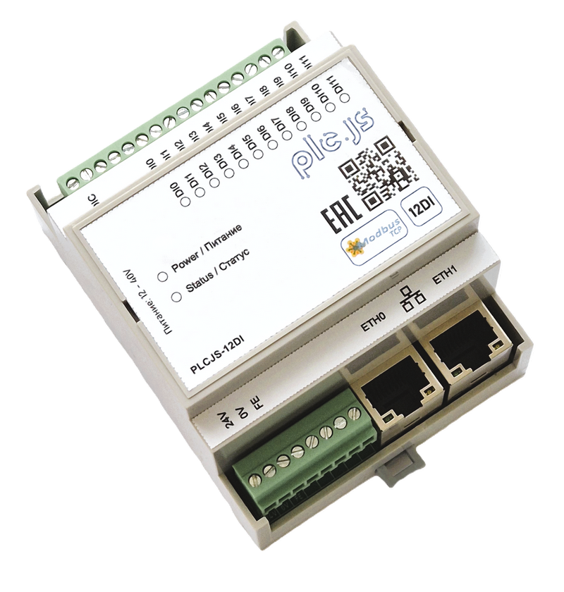
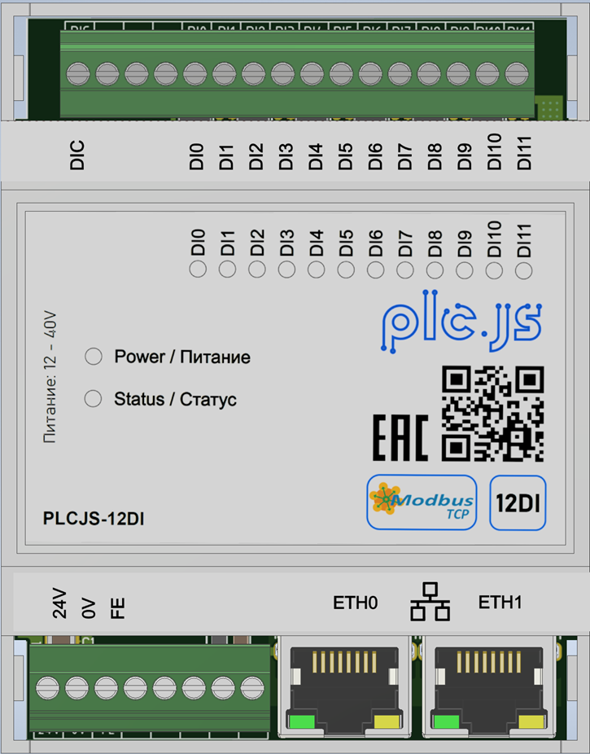

# PLCJS Ethernet 12DI

Industrial automation Ethernet module with **12 discrete 24 VDC inputs** for
sensors, pushbuttons, limit switches, relay contacts and other two-state
signals. The module communicates with a PLC, SCADA or HMI over Modbus TCP.

Model: **PLCJS ETH 12DI**

Hardware platform: **STM32F407VGT6**

Channels: **12 discrete inputs**

<p align="center">
  
</p>

<p align="center"><strong>External view</strong></p>

> Register addresses in this document use zero-based Modbus protocol addressing.
> If your SCADA/HMI displays `3xxxx`/`4xxxx` addresses starting from one, apply
> the address offset required by that software.

## 1. Purpose and applications

The module is intended for centralized acquisition of discrete signals over
Ethernet and Modbus TCP.

Typical signal sources:

- control pushbuttons and emergency-stop auxiliary contacts;
- limit switches and position sensors;
- reed switches and dry contacts;
- auxiliary contacts of relays and contactors;
- discrete equipment sensors;
- cabinet, breaker and actuator status signals;
- interlock and permissive signals.

Typical applications:

- remote equipment status monitoring;
- distributed PLC/SCADA/HMI input modules;
- automation cabinet diagnostics;
- discrete event acquisition by a supervisory controller;
- distributed Ethernet I/O systems.

The module is a **discrete input device**. It does not independently execute a
process-control algorithm and is not a replacement for a PLC, safety relay or
certified emergency-shutdown device.

## 2. Main features

- 12 independent discrete inputs DI1…DI12;
- input state available through Modbus TCP FC02 and FC04;
- configurable digital debounce filter from 10 to 1000 ms;
- 12-bit filtered input mask;
- internal MCU temperature value for diagnostics;
- two external Ethernet ports through the integrated KSZ8863 switch;
- hardware pass-through forwarding between the external ports while the module
  is powered;
- AutoIP/link-local factory addressing `169.254.x.y`;
- MAC-based discovery and network assignment through PLCJS Discovery Protocol
  (PDP);
- static IPv4 and DHCP modes;
- live network configuration after saving, without an application reboot;
- unique locally administered MAC derived from the STM32 UID;
- CRC32-protected settings stored in internal Flash;
- hardware-button and Modbus factory reset;
- Ethernet bootloader handover for OTA updates;
- independent watchdog;
- STAT_LED indication of Ethernet/Modbus state;
- operator recovery command for the KSZ8863 switch.

## 3. Quick start

1. Connect the module power supply.
2. Connect the discrete signals to DI1…DI12 according to the product wiring
   diagram; the input circuit uses a common-minus arrangement.
3. In the factory state, the module uses the link-local address
   `169.254.<mac[4]>.<mac[5]>` with mask `255.255.0.0`.
4. Open the **Discovery** tab in ModbusTool and scan through the required network
   adapter.
5. Select the device by MAC and assign one of these modes:
   - static IPv4;
   - DHCP;
   - link-local.
6. To receive discovery responses, allow inbound UDP port `20556` in Windows
   Firewall:

```powershell
New-NetFirewallRule -DisplayName "PLCJS PDP discovery" -Direction Inbound `
    -Protocol UDP -LocalPort 20556 -Action Allow
```

7. Connect a Modbus TCP client to the assigned address, port `502`, Unit ID `1`.
8. Read the inputs using FC02 or FC04. For a functional test, apply the rated
   input signal according to the wiring diagram and check the corresponding
   channel state.

The label MAC/link-local address can be calculated from the device UID before
flashing:

```powershell
node tools/device_id.mjs --stlink --variant 12di
node tools/device_id.mjs <24-hex-UID> --variant 12di --csv
```

## 4. User and product characteristics

### 4.1 Functional characteristics

| Parameter | Value |
|---|---|
| Product type | Ethernet discrete input module |
| Number of discrete inputs | 12 |
| Channel designations | DI1…DI12 |
| Input signal type | Two-state discrete signal |
| External signal logic | Active-high: applying the input voltage means active state |
| MCU GPIO level | Active-low after the hardware input stage |
| Active signal connection | Apply 24 V to the input relative to DI_COM |
| Input galvanic isolation | 2000 V |
| Nominal input voltage | 24 V |
| Input voltage range | 12…30 V |
| ON threshold | 20.5 V |
| OFF threshold | 5.3 V |
| Channel resistance | 3.3 kΩ |
| Input overvoltage protection | 28 V ESD suppressor |
| Reverse-polarity protection | No |
| Digital filter range | 10…1000 ms |
| Factory filter value | 50 ms |
| Control interface | Modbus TCP |
| Simultaneous Modbus TCP clients | 1 |
| Default Modbus TCP port | 502 |
| Device discovery | PDP, UDP broadcast, port 20556 |
| Factory reset | `FACT_RES` button and Modbus command |
| Status indication | STAT_LED, active-high |
| Watchdog | IWDG |

### 4.2 Complete module characteristics

Values that are not confirmed by the approved schematic, specification or test
report are intentionally left blank.

| Product parameter | Value |
|---|---|
| Product name | PLCJS Ethernet 12DI / D4MG |
| Product type | Industrial automation module |
| Mounting | DIN rail |
| Enclosure material | ABS plastic |
| Enclosure protection rating | IP20 |
| Dimensions, W × H × D | 72 × 90 × 60 mm |
| Mass | 150 g |
| Operating temperature | -20…+60 °C |
| Storage temperature | -40…+85 °C |
| Relative humidity | 5…95% |
| Maximum operating altitude | Up to 2000 m |
| Supply voltage | 24 V |
| Allowed supply range | 12…36 V |
| Power consumption | 1.5 W |
| Current consumption | 62.5 mA |
| Power connector | 3.5 mm screw terminal |
| Reverse-polarity protection | No |
| Supply transient protection | 40 V ESD suppressor |
| Ethernet interface | 10/100 Mbps, RMII through KSZ8863 |
| Number of external Ethernet ports | 2 |
| Ethernet connector | RJ45 |
| Ethernet auto-negotiation | Yes |
| Maximum copper Ethernet segment | 100 m, subject to cable and network requirements |
| Ethernet galvanic isolation | Yes |
| ESD protection level | 8 kV contact / 15 kV air |
| EFT/Burst protection level | 2 kV |
| Surge protection level |  |
| Radiated RF immunity |  |
| Radiated/conducted emissions |  |
| EMC/EMI compliance | Yes |
| RoHS compliance | Yes |
| CE/EAC/UL compliance | Yes |
| MTBF | 50,000 h |
| Service life | 6 years |
| Warranty | 2 years |

> Electrical input limits, power requirements, EMC/ESD ratings and mechanical
> characteristics must be confirmed against the approved hardware revision,
> schematic, BOM and test reports. This README is not a substitute for the
> approved product passport or electrical safety documentation.

### 4.3 Service and diagnostic characteristics

| Parameter | Value |
|---|---|
| Unique MAC | Locally administered unicast, derived from the 96-bit STM32 UID |
| Factory link-local format | `169.254.<mac[4]>.<mac[5]>` |
| Link-local mask | `255.255.0.0` |
| Reserved static IP fields | `192.168.1.10/24` |
| Reserved gateway | `192.168.1.1` |
| Network modes | `0` static, `1` DHCP, `2` link-local |
| IP/mode application | Live after `TRIG_SAVE` |
| Settings storage | Internal Flash with CRC32 |
| Bootloader handover | Modbus `0xB007`, PDP command or OTA client |
| KSZ8863 recovery | Modbus `0x8863` in holding register 118 |
| Factory reset | Modbus `0xDEAD` in holding register 119 or `FACT_RES` |
| Hardware revision | `0x010101` |
| Firmware version | `0x0106` / 1.6 |
| Module ID | `0x12D1` |
| Product ID | `0x504C1201` |

## 5. Wiring and input logic

### Wiring diagram

<p align="center">
  
</p>

<p align="center"><strong>Wiring diagram</strong></p>

Each DI1…DI12 channel is independent. The external input signal is active-high:
applying the rated voltage relative to DI_COM produces an active input state.
The MCU GPIO itself is read as active-low because the hardware input stage
inverts the signal.

| Channel | Modbus index | Logical `1` | Logical `0` | MCU GPIO |
|---|---:|---|---|---|
| DI1 | 0 | active / input voltage applied | inactive | PD7 |
| DI2 | 1 | active / input voltage applied | inactive | PD6 |
| DI3 | 2 | active / input voltage applied | inactive | PD5 |
| DI4 | 3 | active / input voltage applied | inactive | PD4 |
| DI5 | 4 | active / input voltage applied | inactive | PD3 |
| DI6 | 5 | active / input voltage applied | inactive | PD2 |
| DI7 | 6 | active / input voltage applied | inactive | PD1 |
| DI8 | 7 | active / input voltage applied | inactive | PD0 |
| DI9 | 8 | active / input voltage applied | inactive | PC12 |
| DI10 | 9 | active / input voltage applied | inactive | PC11 |
| DI11 | 10 | active / input voltage applied | inactive | PC10 |
| DI12 | 11 | active / input voltage applied | inactive | PB3 |

> GPIO names are provided for firmware diagnostics only. External wiring must
> follow the product electrical diagram and the specified input ratings.

### Digital input filter

The filter is applied to each input before its state is published through
Modbus. The value is specified in milliseconds and is limited to `10…1000 ms`.

- values below `10 ms` return a Modbus error;
- values above `1000 ms` return a Modbus error;
- factory value is `50 ms`;
- the input driver is sampled by a dedicated 1 ms task;
- the filter changes immediately; use register `117` to save it to Flash.

## 6. Modbus TCP map

### 6.1 Protocol parameters

| Parameter | Value |
|---|---|
| Transport | Modbus TCP over Ethernet |
| Default TCP port | 502 |
| Default Unit ID | 1 |
| Simultaneous clients | 1 |
| FC02 | Read Discrete Inputs |
| FC03 | Read Holding Registers |
| FC04 | Read Input Registers |
| FC06 | Write Single Holding Register |
| FC16 / `0x10` | Write Multiple Holding Registers |
| FC01/FC05/FC15 | Not used by the application |
| FC02/FC04 input state | Filtered state |

### 6.2 Discrete Inputs — FC02

Addresses `0…11` contain the filtered state of DI1…DI12.

| Address | Channel | Value `0` | Value `1` | Access |
|---:|---|---|---|---|
| 0 | DI1 | inactive | active | R |
| 1 | DI2 | inactive | active | R |
| 2 | DI3 | inactive | active | R |
| 3 | DI4 | inactive | active | R |
| 4 | DI5 | inactive | active | R |
| 5 | DI6 | inactive | active | R |
| 6 | DI7 | inactive | active | R |
| 7 | DI8 | inactive | active | R |
| 8 | DI9 | inactive | active | R |
| 9 | DI10 | inactive | active | R |
| 10 | DI11 | inactive | active | R |
| 11 | DI12 | inactive | active | R |

### 6.3 Input Registers — FC04

| Address | Name | Format | Description | Access |
|---:|---|---|---|---|
| 0…11 | `DI1…DI12` | `uint16`, 0/1 | Filtered state of the corresponding input | R |
| 120 | `FW_VERSION_MAJOR` | `uint16` | Major firmware version; for 1.6: `1` | R |
| 121 | `FW_VERSION_MINOR` | `uint16` | Minor firmware version; for 1.6: `6` | R |
| 122 | `UPTIME_LO` | `uint16` | Operating seconds, low word | R |
| 123 | `UPTIME_HI` | `uint16` | Operating seconds, high word | R |
| 124 | `DI_MASK` | `uint16` | 12-bit filtered input mask, bit 0 = DI1 | R |
| 125 | `MODULE_ID` | `uint16` | Module identifier: `0x12D1` | R |

```text
uptime_seconds = (IR123 << 16) | IR122
```

Mask mapping:

```text
DI_MASK bit 0  = DI1
DI_MASK bit 1  = DI2
...
DI_MASK bit 11 = DI12
```

### 6.4 Holding Registers — FC03 / FC06 / FC16

| Address | Name | Format / range | Factory value | Description | Access |
|---:|---|---|---:|---|---|
| 100 | `DI_FILTER_MS` | `10…1000` ms | 50 | Digital input debounce filter | R/W |
| 101 | `LED_MODE` | `0…2` | 2 | STAT_LED operating mode | R/W |
| 102 | `SLAVE_ID` | `1…247` | 1 | Informational TCP Unit ID | R/W |
| 103 | `TCP_PORT` | `1…65535` | 502 | Application TCP port | R/W |
| 104 | `IP_OCTET_1` | `0…255` | 192 | First reserved static IP octet | R/W |
| 105 | `IP_OCTET_2` | `0…255` | 168 | Second reserved static IP octet | R/W |
| 106 | `IP_OCTET_3` | `0…255` | 1 | Third reserved static IP octet | R/W |
| 107 | `IP_OCTET_4` | `0…255` | 10 | Fourth reserved static IP octet | R/W |
| 108 | `MASK_OCTET_1` | `0…255` | 255 | First netmask octet | R/W |
| 109 | `MASK_OCTET_2` | `0…255` | 255 | Second netmask octet | R/W |
| 110 | `MASK_OCTET_3` | `0…255` | 255 | Third netmask octet | R/W |
| 111 | `MASK_OCTET_4` | `0…255` | 0 | Fourth netmask octet | R/W |
| 112 | `GW_OCTET_1` | `0…255` | 192 | First gateway octet | R/W |
| 113 | `GW_OCTET_2` | `0…255` | 168 | Second gateway octet | R/W |
| 114 | `GW_OCTET_3` | `0…255` | 1 | Third gateway octet | R/W |
| 115 | `GW_OCTET_4` | `0…255` | 1 | Fourth gateway octet | R/W |
| 116 | `NET_MODE` / `USE_DHCP` | `0…2` | 2 | `0` static, `1` DHCP, `2` link-local | R/W |
| 117 | `TRIG_SAVE` | `0xA5A5` | 0 | Save settings and apply them | W |
| 118 | `TRIG_REBOOT` | `0xB00B` | 0 | Reboot the application | W |
| 118 | `TRIG_BOOTLOADER` | `0xB007` | 0 | Enter Ethernet bootloader | W |
| 118 | `TRIG_SWITCH_RESET` | `0x8863` | 0 | Hardware-reset KSZ8863 | W |
| 119 | `TRIG_FACTORY_RESET` | `0xDEAD` | 0 | Reset, save defaults and reboot | W |
| 130 | `MCU_TEMPERATURE` | signed, 0.1 °C |  | Internal MCU temperature, ADC1_IN16 | R |

#### STAT_LED modes

| Code | Mode | Description |
|---:|---|---|
| 0 | `ALW_OFF` | LED off |
| 1 | `ALW_ON` | LED continuously on |
| 2 | `STATE_MACHINE` | Ethernet/Modbus state indication |

#### Network modes

| Code | Mode | Description |
|---:|---|---|
| 0 | `STATIC` | Use the IP/netmask/gateway fields |
| 1 | `DHCP` | Address is assigned by a DHCP server |
| 2 | `LINK_LOCAL` | `169.254.<mac[4]>.<mac[5]>`, `/16`, no gateway |

`TRIG_SAVE` is handled by the application housekeeping loop. IP/mode changes are
applied through `tcpip_callback`, so an application reboot is not required. The
current TCP session may be dropped after an IP change.

`TRIG_SWITCH_RESET` resets the KSZ8863 and intentionally interrupts Ethernet
while the switch resets and its ports renegotiate. Use it only to recover a
non-responsive switch. A normal MCU reboot must not reset the KSZ8863.

## 7. Discovery and network assignment

The module supports PLCJS Discovery Protocol (PDP), UDP broadcast, port `20556`.

| Command | Request | Response | Purpose |
|---|---:|---:|---|
| `IDENTIFY` | `0x01` | `0x81` | MAC, Product ID, HW/FW, network mode, IP, name |
| `SET_NET` | `0x02` | `0x82` | Assign static/DHCP/link-local live |
| `SET_NAME` | `0x03` | `0x83` | Set a device name up to 15 characters |
| `FLASH_LED` | `0x04` | `0x84` | Flash STAT_LED for a specified time |
| `REBOOT` | `0x05` | `0x85` | Reboot the application |
| `FACTORY` | `0x06` | `0x86` | Reset application settings |

Responses are broadcast, so a module can be found by MAC on the same L2 segment
even when its IP is unknown or belongs to another subnet. The host must allow
inbound UDP `20556` to receive responses.

## 8. Ethernet pass-through and KSZ8863 reset policy

KSZ8863 is used as an integrated Ethernet switch/PHY. Traffic between the two
external ports is forwarded in hardware and does not depend on Modbus processing
by the MCU.

Reset policy:

- KSZ8863 is hardware-reset only on a cold/power-on boot;
- during a warm MCU reset, ETHRST is not asserted, so pass-through traffic should
  remain uninterrupted;
- a limited automatic recovery is available when SMI communication fails;
- operator recovery is performed with `HR118 = 0x8863` and intentionally
  interrupts Ethernet while KSZ8863 restarts.

## 9. OTA update

The application image contains `fw_header_t` at offset `0x200` with `PLCJ` magic,
Product ID, hardware revision and firmware version. The bootloader validates these
fields before installation.

The reference `fw_update.mjs` client automatically:

1. obtains the application MAC through discovery;
2. requests bootloader mode;
3. finds the bootloader by MAC through PDP;
4. assigns a reachable bootloader IP with `SET_NET` when necessary;
5. performs `BEGIN → WRITE_BLOCKS → FINALIZE → INSTALL`.

Example:

```powershell
node tools/fw_update.mjs app-bootloader --app-ip 192.168.1.10 --nic 192.168.1.1
node tools/fw_update.mjs update build/Release/PLCJS_ETH_MODULE_12DI_D4MG_STM32F407VGT6.bin --nic 192.168.1.1
```

## 10. Reset and recovery

### Factory reset

Factory reset can be initiated by:

- holding the `FACT_RES` button during startup;
- writing `0xDEAD` to holding register `119`.

The module restores default settings, saves them to Flash, indicates the reset
state and reboots.

### Application reboot

Writing `0xB00B` to holding register `118` reboots the application. The KSZ8863
should remain running on an intermediate module during this warm reset.

## 11. Flash layout

| Region | Address | Size | Purpose |
|---|---:|---:|---|
| Bootloader | `0x08000000` | 128 KB | sectors 0…4 |
| Metadata | `0x08020000` | 128 KB | sector 5, OTA state |
| Application | `0x08040000` | 256 KB | sectors 6…7 |
| Staging | `0x08080000` | 256 KB | sectors 8…9, OTA staging |
| Settings | `0x080C0000` | 128 KB | sector 10 |

Shared bootloader request flag: `0x2001FFF0`, magic `0xB007CAFE`.

## 12. Development and build details

### Build

Required tools: STM32CubeCLT, `starm-clang`, CMake and Ninja.

```powershell
cmake --preset Release
cmake --build --preset Release
```

Build results are written to `build/Release/`:

- `.elf` — executable/debug image;
- `.hex` — ST-Link image;
- `.bin` — OTA image for the bootloader.

### Firmware architecture

- STM32 HAL/CMSIS handles GPIO, ADC and watchdog;
- FreeRTOS runs the DI sampling and LED indication tasks;
- `di_module` samples inputs at 1 ms and applies the debounce filter;
- nanoMODBUS provides FC02/FC03/FC04/FC06/FC16 callbacks;
- LwIP provides Ethernet and Modbus TCP;
- KSZ8863 operates as the pass-through Ethernet switch and is accessed through
  SMI;
- settings are stored in Flash with CRC32 protection;
- `fw_header_t` binds an image to Product ID, HW revision and firmware version;
- the bootloader stages, verifies and installs OTA images;
- PDP is implemented as a minimal raw-LwIP UDP responder;
- MAC and factory link-local address are derived deterministically from the STM32
  UID;
- the OTA client finds the bootloader by MAC instead of relying on a fixed IP.

### Image identity

| Field | 12DI value |
|---|---|
| Module ID | `0x12D1` |
| Product ID | `0x504C1201` |
| HW revision | `0x010101` |
| Firmware version | `0x0106` / 1.6 |

An image built for another hardware variant must not be installed; the bootloader
rejects a Product ID or hardware revision mismatch.

## 13. Unknown and pending product parameters

The following items must be confirmed against the approved hardware revision,
electrical documentation and test reports before this README is used as a formal
product passport:

- supply voltage and absolute supply limits;
- maximum power and current consumption;
- input electrical limits and current;
- galvanic isolation implementation and rating;
- ESD, EFT/Burst and Surge levels;
- operating/storage temperature and humidity;
- enclosure protection, dimensions and materials;
- EMC/EMI and regulatory compliance;
- connector types and terminal specifications;
- warranty, service life and MTBF.
